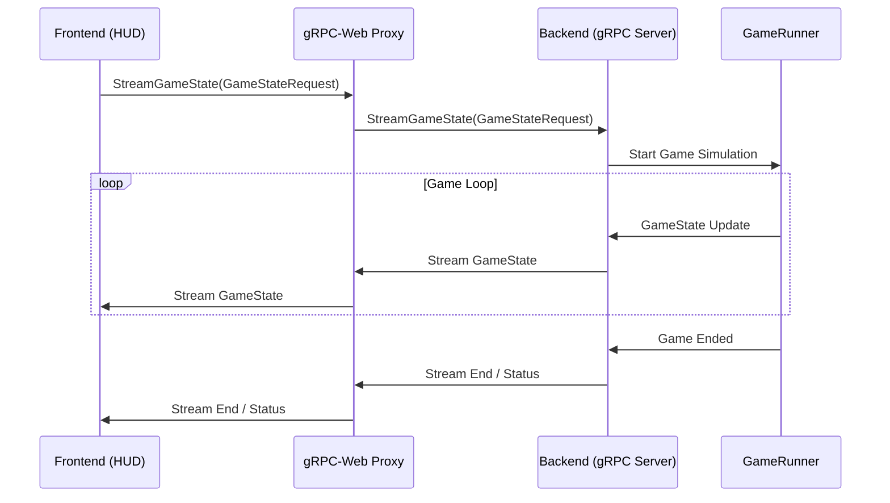
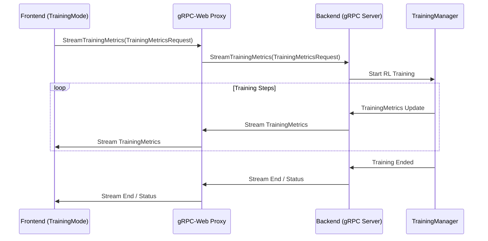

# Phase 3: gRPC 상세 설계 및 아키텍처 문서

## 1. .proto 파일 상세 정의

gRPC 통신을 위한 핵심 데이터 구조와 서비스 인터페이스를 정의하는 Protocol Buffers (`.proto`) 파일에 대한 상세 명세입니다.

### 1.1. `game.proto`

게임 상태 스트리밍을 위한 메시지 및 서비스를 정의합니다.

```protobuf
syntax = "proto3";

package game;

// 플레이어의 현재 상태를 정의합니다.
message PlayerState {
  int32 health = 1;         // 현재 체력 (0-100)
  int32 super_gauge = 2;    // 슈퍼 게이지 (0-100)
  int32 position_x = 3;     // X 좌표
  int32 position_y = 4;     // Y 좌표
  string current_action = 5; // 현재 행동 (예: "IDLE", "WALK", "JUMP", "ATTACK")
}

// 게임의 전체 상태를 정의합니다.
message GameState {
  string match_id = 1;      // 현재 매치의 고유 ID
  int32 timer = 2;          // 남은 시간 (초)
  PlayerState player1 = 3;  // Player 1의 상태
  PlayerState player2 = 4;  // Player 2의 상태
  optional int32 winner_id = 5; // 승리한 플레이어의 ID (없으면 null)
}

// 게임 상태 스트리밍 요청 메시지
message GameStateRequest {
  string match_id = 1;      // 스트리밍할 매치의 ID
  int32 player1_id = 2;     // Player 1의 캐릭터 ID
  int32 player2_id = 3;     // Player 2의 캐릭터 ID
}

// 게임 서비스 인터페이스
service GameService {
  // 서버-사이드 스트리밍 RPC: 게임 상태 업데이트를 클라이언트로 지속적으로 전송합니다.
  rpc StreamGameState(GameStateRequest) returns (stream GameState);
}
```

**주요 RPC 메서드**:
*   `StreamGameState(GameStateRequest) returns (stream GameState)`: 클라이언트가 `GameStateRequest`를 보내면, 서버는 해당 매치의 `GameState`를 실시간으로 스트리밍합니다.

### 1.2. `training.proto`

강화학습 메트릭 스트리밍을 위한 메시지 및 서비스를 정의합니다.

```protobuf
syntax = "proto3";

package training;

// 강화학습 메트릭을 정의합니다.
message TrainingMetrics {
  string session_id = 1;    // 학습 세션의 고유 ID
  int32 step = 2;           // 현재 타임스텝
  int32 episode = 3;        // 현재 에피소드 번호
  float loss = 4;           // 모델의 손실 값
  float reward = 5;         // 에피소드 보상
  optional float q_value = 6; // Q-Value (선택 사항)
  int32 episode_length = 7; // 에피소드 길이
}

// 학습 메트릭 스트리밍 요청 메시지
message TrainingMetricsRequest {
  string session_id = 1;    // 스트리밍할 학습 세션의 ID
}

// 학습 서비스 인터페이스
service TrainingService {
  // 서버-사이드 스트리밍 RPC: 학습 메트릭 업데이트를 클라이언트로 지속적으로 전송합니다.
  rpc StreamTrainingMetrics(TrainingMetricsRequest) returns (stream TrainingMetrics);
}
```

**주요 RPC 메서드**:
*   `StreamTrainingMetrics(TrainingMetricsRequest) returns (stream TrainingMetrics)`: 클라이언트가 `TrainingMetricsRequest`를 보내면, 서버는 해당 세션의 `TrainingMetrics`를 실시간으로 스트리밍합니다.

## 2. 아키텍처 다이어그램 및 데이터 흐름

gRPC 통합 후의 시스템 아키텍처와 주요 데이터 흐름을 설명합니다.

### 2.1. 시스템 아키텍처 다이어그램

```mermaid
graph TD
    subgraph Frontend (React App)
        HUD[HUD Component]
        TrainingMode[TrainingMode Component]
    end

    subgraph gRPC-Web Proxy (Envoy / Nginx)
        Proxy[gRPC-Web Proxy]
    end

    subgraph Backend (Python FastAPI + gRPC Server)
        FastAPI[FastAPI (REST API)]
        gRPCServer[gRPC Server]
        GameRunner[GameRunner (Pygame Env)]
        TrainingManager[TrainingManager (RL Training)]
    end

    HUD -- gRPC Stream (GameState) --> Proxy
    TrainingMode -- gRPC Stream (TrainingMetrics) --> Proxy
    Proxy -- gRPC Stream --> gRPCServer

    HUD -- HTTP (Character/Matchup) --> FastAPI
    TrainingMode -- HTTP (if any) --> FastAPI

    gRPCServer -- GameState Updates --> GameRunner
    gRPCServer -- TrainingMetrics Updates --> TrainingManager

    GameRunner -- GameState Stream --> gRPCServer
    TrainingManager -- TrainingMetrics Stream --> gRPCServer
```

### 2.2. 데이터 흐름 시퀀스 다이어그램

#### 2.2.1. 게임 상태 스트리밍 (`HUD` 컴포넌트)



#### 2.2.2. 학습 메트릭 스트리밍 (`TrainingMode` 컴포넌트)



## 3. FastAPI와 gRPC 서버 연동 방안

현재 FastAPI는 REST API와 기존 WebSocket 엔드포인트를 처리합니다. gRPC 서버는 다음과 같은 방식으로 연동될 수 있습니다.

### 3.1. 단일 프로세스 내 통합 (권장)

*   FastAPI 애플리케이션과 gRPC 서버를 동일한 Python 프로세스 내에서 실행합니다.
*   `uvicorn`과 같은 ASGI 서버가 FastAPI를 서빙하고, gRPC 서버는 별도의 스레드 또는 `asyncio` 태스크로 실행됩니다.
*   **장점**: 배포 및 관리가 단순합니다.
*   **단점**: gRPC 서버의 부하가 FastAPI 애플리케이션에 영향을 줄 수 있습니다.

### 3.2. 별도 프로세스/서비스 분리

*   FastAPI 서버와 gRPC 서버를 완전히 별개의 프로세스 또는 마이크로서비스로 분리하여 실행합니다.
*   **장점**: 각 서비스의 독립적인 확장 및 관리가 용이합니다. 관심사 분리가 명확합니다.
*   **단점**: 배포 및 관리가 복잡해집니다. 서비스 간 통신 오버헤드가 발생할 수 있습니다.

현재 프로젝트 규모와 복잡도를 고려할 때, **단일 프로세스 내 통합 방식**을 우선적으로 고려합니다.

## 4. 의존성 및 도구

*   **백엔드 (Python)**:
    *   `grpcio`: gRPC 런타임 라이브러리
    *   `grpcio-tools`: `.proto` 파일 컴파일러 및 코드 생성 도구
*   **프론트엔드 (Node.js/TypeScript)**:
    *   `@grpc/grpc-js`: Node.js gRPC 런타임
    *   `@grpc/proto-loader`: `.proto` 파일 로더
    *   `grpc-tools`: `.proto` 파일 컴파일러 및 코드 생성 도구
    *   `grpc-web`: 브라우저에서 gRPC 서버와 통신하기 위한 클라이언트 라이브러리

## 5. 향후 개발 방향

*   `.proto` 파일 정의 및 코드 생성 완료 후, 백엔드 gRPC 서버 구현을 시작합니다.
*   백엔드 gRPC 서버가 정상 작동하면, 프론트엔드 컴포넌트(`HUD`, `TrainingMode`)를 gRPC 클라이언트로 전환합니다.
*   gRPC-Web 프록시(예: Envoy) 설정 및 통합을 진행합니다.
