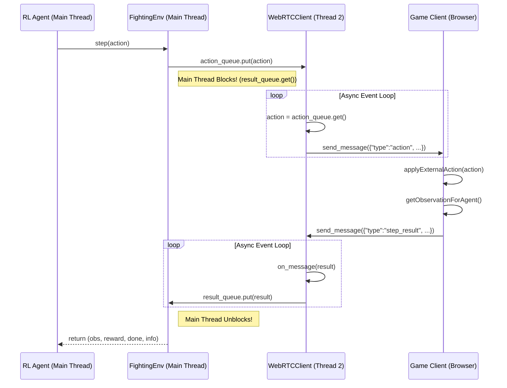

# WebRTC-RL 연동: API 및 인터페이스 정의서

본 문서는 강화학습(RL) 에이전트와 프론트엔드 게임 클라이언트 간의 WebRTC 연동에 필요한 모든 데이터 구조, API, 클래스, 함수의 시그니처를 상세히 정의한다.

---

## 1. 공통 데이터 프로토콜 (JSON API)

백엔드와 프론트엔드 간의 모든 통신은 아래에 정의된 JSON 형식의 메시지를 통해 이루어진다.

### 1.1. 백엔드 -> 프론트엔드

*   **액션 수행 (`action`)**: 에이전트가 결정한 행동을 게임 클라이언트에 전달.
    ```json
    {
      "type": "action",
      "action": <number>
    }
    ```

*   **환경 리셋 (`reset`)**: 게임 클라이언트에 환경 초기화를 명령.
    ```json
    {
      "type": "reset"
    }
    ```

### 1.2. 프론트엔드 -> 백엔드

*   **스텝 결과 (`step_result`)**: `action` 수행 후의 게임 상태를 백엔드에 보고.
    ```json
    {
      "type": "step_result",
      "observation": <number[]>,
      "reward": <number>,
      "done": <boolean>
    }
    ```

*   **리셋 결과 (`reset_result`)**: `reset` 명령 수행 후의 초기 게임 상태를 백엔드에 보고.
    ```json
    {
      "type": "reset_result",
      "observation": <number[]>
    }
    ```
*   **연결 확인 (`connection_ready`)**: 데이터 채널 연결이 준비되었음을 알림.
    ```json
    {
        "type": "connection_ready"
    }
    ```

---

## 2. 백엔드 (Python) 명세

### 2.1. `src/webrtc_client.py`

```python
import queue
import asyncio
from aiortc import RTCPeerConnection, RTCDataChannel

class WebRTCClient:
    """
    aiortc를 사용하여 WebRTC 연결 및 통신을 관리하는 비동기 클라이언트.
    별도 스레드에서 실행된다.
    """

    def __init__(self, action_queue: queue.Queue, result_queue: queue.Queue):
        """
        메인 스레드와의 통신을 위한 큐를 초기화한다.
        """
        pass

    def run(self, peer_id: str) -> None:
        """
        스레드의 진입점. asyncio 이벤트 루프를 시작하고 connect를 호출한다.
        """
        pass

    async def connect(self, peer_id: str) -> None:
        """
        PeerJS 시그널링 서버에 연결하고 데이터 채널을 설정한다.
        성공적으로 연결되면 result_queue에 연결 성공 메시지를 넣는다.
        """
        pass

    async def close(self) -> None:
        """
        모든 WebRTC 연결을 종료한다.
        """
        pass

    # --- Private Methods (내부적으로 `run`에서 호출) ---

    async def _message_handler(self, channel: RTCDataChannel) -> None:
        """
        데이터 채널에서 메시지를 수신하여 result_queue에 넣는다.
        """
        pass

    async def _action_sender(self, channel: RTCDataChannel) -> None:
        """
        action_queue에서 액션을 꺼내 데이터 채널로 전송한다.
        """
        pass
```

### 2.2. `src/fighting_env.py`

```python
import gymnasium as gym
import numpy as np
from typing import Tuple

class FightingEnv(gym.Env):
    """
    WebRTC를 통해 브라우저 게임과 통신하는 OpenAI Gym 환경.
    """

    def __init__(self, peer_id: str):
        """
        WebRTCClient 스레드를 시작하고 연결이 완료될 때까지 대기한다.
        action_space와 observation_space를 정의한다.
        """
        super().__init__()
        # 예시: self.action_space = gym.spaces.Discrete(6)
        # 예시: self.observation_space = gym.spaces.Box(low=-1, high=1, shape=(N,), dtype=np.float32)
        pass

    def step(self, action: int) -> Tuple[np.ndarray, float, bool, dict]:
        """
        action을 WebRTC를 통해 전송하고, 결과를 수신하여 반환한다.
        """
        pass

    def reset(self) -> np.ndarray:
        """
        reset 명령을 WebRTC를 통해 전송하고, 초기 observation을 수신하여 반환한다.
        """
        pass

    def close(self) -> None:
        """
        WebRTC 클라이언트 스레드를 종료시킨다.
        """
        pass
```

---

## 3. 프론트엔드 (TypeScript) 명세

### 3.1. `arcade-clash/types.ts` (또는 신규 `rl_types.ts`)

```typescript
// --- 통신 메시지 타입 ---

export interface ActionMessage {
  type: 'action';
  action: number;
}

export interface ResetMessage {
  type: 'reset';
}

export type BackendMessage = ActionMessage | ResetMessage;

export interface StepResultMessage {
  type: 'step_result';
  observation: number[];
  reward: number;
  done: boolean;
}

export interface ResetResultMessage {
  type: 'reset_result';
  observation: number[];
}

export interface ConnectionReadyMessage {
    type: 'connection_ready';
}

export type FrontendMessage = StepResultMessage | ResetResultMessage | ConnectionReadyMessage;
```

### 3.2. `arcade-clash/components/RLAgentController.tsx`

```typescript
import React from 'react';

interface RLAgentControllerProps {
  // 백엔드 Peer의 ID
  backendPeerId: string;
}

const RLAgentController: React.FC<RLAgentControllerProps> = ({ backendPeerId }) => {
  // UI 렌더링 없음 (Headless)
  return null;
};

export default RLAgentController;
```

### 3.3. `arcade-clash/shared_game_logic/engine.ts`

```typescript
/**
 * RL 에이전트가 보낸 action을 게임에 적용한다.
 * @param action 에이전트가 선택한 행동을 나타내는 숫자
 */
export declare function applyExternalAction(action: number): void;

/**
 * 현재 게임 상태를 RL 에이전트가 사용할 수 있는 숫자 배열로 변환하여 반환한다.
 * @returns 정규화된 observation 값들의 배열
 */
export declare function getObservationForAgent(): number[];

/**
 * 현재 게임 상태를 기반으로 보상을 계산하여 반환한다.
 * (이 함수는 프론트엔드에서 보상을 계산할 경우에만 필요)
 * @returns 계산된 보상 값
 */
export declare function calculateReward(): number;
```

---

## 4. 통신 흐름 및 Race Condition 방지

### 4.1. 시퀀스 다이어그램 (Sequence Diagram)

`step` 함수 호출 시 메시지 교환 순서는 다음과 같다.



### 4.2. Race Condition 방지 설계

본 아키텍처는 '스레드 + 큐' 조합을 통해 **'Lock-Step'** 방식으로 통신 순서를 강제하여 Race Condition을 원천적으로 방지한다.

1.  **동기적(Blocking) 호출**: `FightingEnv`의 `step`과 `reset` 메서드는 내부적으로 `result_queue.get()`을 호출하는 순간 **블로킹(Blocking)**된다. 즉, 프론트엔드로부터 해당 요청에 대한 응답이 큐에 들어올 때까지 RL 에이전트(메인 스레드)는 다음 코드를 실행하지 않고 멈춰서 기다린다.

2.  **1:1 요청-응답 강제**: 이 블로킹 메커니즘 때문에, `step` 함수가 한 번 호출되면, 해당 `step`에 대한 `step_result`가 수신되기 전까지는 절대로 다음 `step` 함수가 호출될 수 없다. 요청과 응답이 항상 1:1로 짝을 이루도록 강제된다.

3.  **순서 보장**: 결과적으로, 프론트엔드가 응답을 2번 보내거나, 백엔드가 응답을 받기 전에 다음 요청을 보내는 등의 메시지 순서가 꼬이는 문제가 발생하지 않는다. 모든 통신은 '요청 -> 대기 -> 응답 -> 재개'의 엄격한 흐름을 따른다.