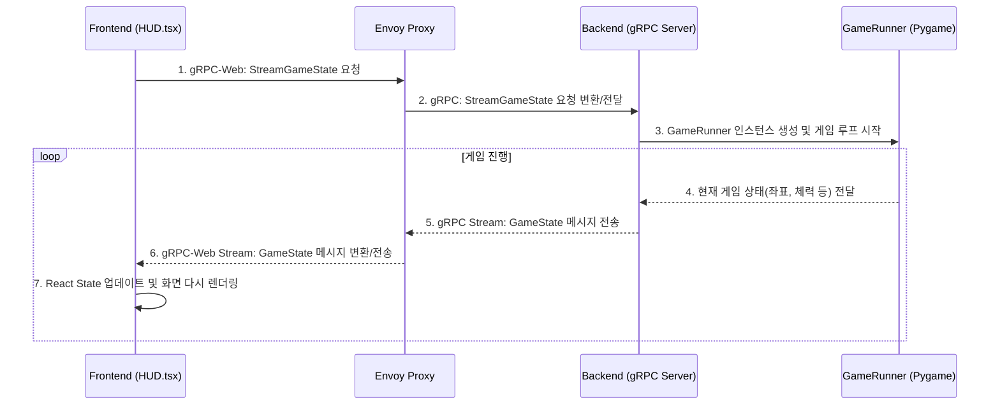
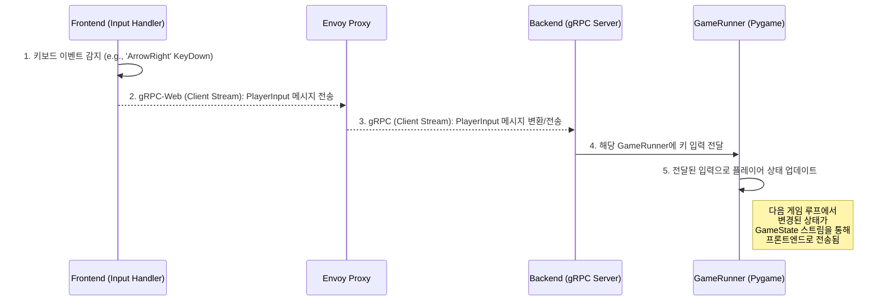

# Phase 4: 시스템 흐름 및 구조도

이 문서는 AI Battle Arena 프로젝트의 전체 시스템 아키텍처, 데이터 흐름, 그리고 핵심 파일 구조를 정의하고 명세합니다.

---

## 1. 시스템 아키텍처 (System Architecture)

### 1.1. 개요

본 시스템은 다음과 같은 3-티어(3-Tier) 구조를 가집니다.

1.  **프론트엔드 (Frontend):** React와 Vite 기반의 웹 애플리케이션으로, 유저 인터페이스(UI)와 사용자 상호작용을 담당합니다. gRPC-Web을 통해 실시간으로 서버와 통신합니다.
2.  **프록시 (Proxy):** Envoy를 사용하여 브라우저의 gRPC-Web 요청을 백엔드의 표준 gRPC 프로토콜로 변환해주는 중간 계층입니다.
3.  **백엔드 (Backend):** Python 기반의 서버로, FastAPI가 REST API를, `grpcio`가 실시간 게임 상태 및 학습 데이터 스트리밍을 처리합니다. 백엔드 내에서 실제 게임 시뮬레이션(Pygame)과 강화학습 모델(Stable-Baselines3)이 동작합니다.

### 1.2. 아키텍처 다이어그램

```mermaid
graph TD
    subgraph Browser
        A[React App (Vite)]
    end

    subgraph Proxy
        B[Envoy Proxy]
    end

    subgraph Backend Server
        C[FastAPI Server]
        D[gRPC Server]
        E[Game Engine (Pygame)]
        F[RL Model (SB3)]
    end

    A -- gRPC-Web (HTTP/1.1 or HTTP/2) --> B
    B -- gRPC (HTTP/2) --> D
    A -- REST API (HTTP) --> C

    D -- Game Logic --> E
    D -- AI Action --> F
    E -- Game State --> D
    F -- Observation --> E
```

---

## 2. 데이터 흐름 (Data Flow)

### 2.1. 게임 상태 실시간 스트리밍

게임 화면이 렌더링될 때, 프론트엔드와 백엔드 간에 게임 상태가 실시간으로 동기화되는 과정입니다.



### 2.2. 플레이어 조작 입력 (구현 예정)

사용자가 키보드를 조작했을 때, 해당 입력이 백엔드의 게임 시뮬레이션에 반영되는 과정입니다.



---

## 3. 주요 파일 구조 정의

프로젝트의 핵심 디렉토리와 파일의 역할은 다음과 같습니다.

```
/ (프로젝트 루트)
├── envoy.yaml                # Envoy 프록시의 라우팅 및 필터 설정 파일
├── backend/                  # Python 백엔드 소스 코드
│   ├── main.py               # FastAPI 앱의 메인 진입점. gRPC 서버를 함께 실행.
│   ├── grpc_server.py        # gRPC 서비스 로직 구현 (GameServicer, TrainingServicer 등)
│   ├── core/
│   │   └── game_runner.py    # 단일 게임 시뮬레이션 인스턴스를 관리하고 실행
│   └── proto/
│       └── game.proto        # Protocol Buffers 데이터 구조 및 서비스 정의
├── arcade-clash/             # React 프론트엔드 소스 코드
│   ├── index.html            # 웹페이지의 기본 HTML 템플릿
│   ├── App.tsx               # 최상위 React 컴포넌트. 화면 전환(라우팅) 관리.
│   ├── components/
│   │   ├── HUD.tsx           # 메인 게임 화면 UI (체력 바, 타이머 등)
│   │   └── Character.tsx     # 단일 게임 캐릭터를 렌더링하는 컴포넌트
│   └── src/grpc/
│       ├── game.ts           # game.proto로부터 자동 생성된 TypeScript 메시지/서비스
│       └── client.ts         # gRPC 클라이언트 인스턴스를 생성하고 관리
└── src/                      # 핵심 게임 엔진 및 AI 환경 소스 코드 (Python)
    ├── fighting_env.py       # OpenAI Gym 규격에 맞춘 격투 게임 환경
    ├── game.py               # Pygame을 사용한 핵심 격투 게임 로직
    ├── player.py             # 플레이어의 속성과 행동을 정의하는 클래스
    └── ai_controller.py      # AI의 행동을 결정하는 컨트롤러
```
