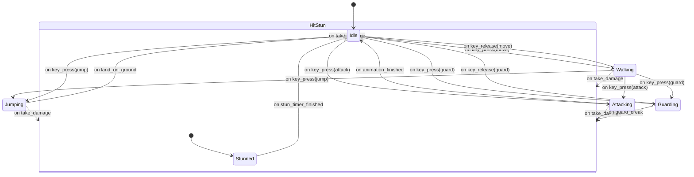
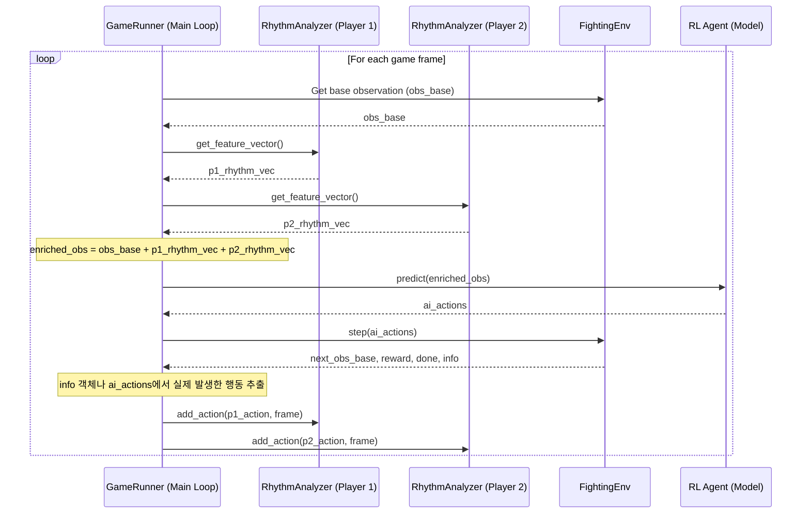

# '전투의 리듬' 기능 기술 명세서

## 1. 개요
이 문서는 '전투의 리듬' 기능 구현에 필요한 백엔드, AI, 프론트엔드의 각 모듈별 기술적 사양을 정의한다. 클래스, 함수, API 인터페이스, 데이터 통신 프로토콜의 구체적인 명세를 다룬다.

---

## 2. 백엔드 명세: `RhythmAnalyzer` 및 `Player`

### 2.1. `RhythmAnalyzer` 클래스 정의
- **위치**: `src/rhythm_analyzer.py`
- **의존성**: `numpy`, `scipy`

```python
class RhythmAnalyzer:
    """
    플레이어의 행동 로그를 기반으로 '전투 리듬' 관련 지표를 실시간으로 계산한다.
    """
```

### 2.2. `RhythmAnalyzer` 속성 (Properties)
- `action_log: collections.deque`: `(action: str, frame: int)` 튜플을 저장하는 Deque. `window_size`에 따라 최대 길이가 제한된다.
- `fps: int`: 시간 계산의 기준이 되는 초당 프레임 수.
- `offensive_actions: set[str]`: 공격으로 분류될 행동 이름의 집합. (예: `{'PUNCH', 'KICK'}`)
- `defensive_actions: set[str]`: 방어로 분류될 행동 이름의 집합. (예: `{'GUARD', 'DODGE'}`)

### 2.3. `RhythmAnalyzer` 메서드 API (Method API)

#### `__init__(self, window_size: int, fps: int)`
- **설명**: `RhythmAnalyzer` 인스턴스를 초기화한다.
- **인자**:
    - `window_size (int)`: 분석할 최대 행동 로그 크기 (프레임 단위).
    - `fps (int)`: 게임의 초당 프레임 수.

#### `add_action(self, action: str, frame: int)`
- **설명**: 새로운 행동 로그를 추가한다.
- **인자**:
    - `action (str)`: 'PUNCH', 'GUARD' 등 행동을 나타내는 문자열.
    - `frame (int)`: 해당 행동이 발생한 게임 프레임 번호.

#### `get_metrics(self) -> dict[str, float]`
- **설명**: 현재까지 수집된 `action_log`를 바탕으로 모든 리듬 지표를 계산하여 딕셔너리 형태로 반환한다.
- **반환값**: `dict`
    - `{"apm", "action_density", "offense_defense_ratio", "rhythm_entropy"}` 키를 포함하며, 값은 `float`이다.

#### `get_feature_vector(self) -> np.ndarray`
- **설명**: AI 강화학습 모델의 입력으로 사용될 고정된 순서의 특징 벡터(1D Numpy 배열)를 반환한다.
- **반환값**: `np.ndarray`. 예: `np.array([apm, action_density, offense_defense_ratio, rhythm_entropy])`

### 2.4. `Player` 상태 머신 다이어그램 (Player State Machine Diagram)
- `Player` 객체는 `구현_알고리즘_명세서.md`에 정의된 로직을 수행하기 위해, 아래 다이어그램에 명시된 상태와 상태 전환 로직을 따라야 한다.



---

## 3. AI 통합 명세: `FightingEnv`

- **위치**: `src/fighting_env.py`

### 3.1. 인터페이스 변경 사항
- `FightingEnv` 클래스는 `GameRunner` 등 상위 실행 주체로부터 `RhythmAnalyzer` 인스턴스를 주입받아야 한다. (의존성 주입)

### 3.2. 데이터 흐름 및 시퀀스 다이어그램
- AI의 `step` 과정에서 각 모듈이 상호작용하는 순서는 아래 다이어그램을 따른다. 이는 옵저버 패턴의 구체적인 구현 흐름이기도 하다.



### 3.3. 관측 공간(Observation Space) 정의
- `RhythmAnalyzer`가 4개의 지표를 반환한다고 가정하면, 각 플레이어당 4개의 차원이 추가되어 총 8개의 차원이 확장된다.
- `gym.spaces.Box`로 정의되는 `observation_space`의 `shape`은 기존 `shape + 8` 로 변경되어야 한다.

---

## 4. 프론트엔드 명세: `BattleRhythmVisualizer`

- **위치**: `arcade-clash/components/BattleRhythmVisualizer.tsx`

### 4.1. 컴포넌트 및 Props 인터페이스
```typescript
// 데이터 항목 인터페이스
interface ActionLogItem {
  action: string; // 행동의 종류
  frame: number;  // 시작 프레임
  duration?: number; // 지속 시간 (프레임 단위, 옵션)
}

// 컴포넌트 Props 인터페이스
interface BattleRhythmVisualizerProps {
  player1Log: ActionLogItem[];
  player2Log: ActionLogItem[];
  totalFrames: number;
}

const BattleRhythmVisualizer: React.FC<BattleRhythmVisualizerProps> = ({...}) => { ... };
```

### 4.2. 기능 명세
- 전체 경기 시간(`totalFrames`)을 가로축으로 하는 타임라인을 렌더링한다.
- `player1Log`와 `player2Log`를 각각 별도의 트랙(상단/하단)에 시각화한다.
- 각 `ActionLogItem`은 타임라인 위의 해당 `frame` 위치에 막대(bar) 형태로 표시된다.
- 막대의 색상이나 아이콘으로 `action`의 종류(공격, 방어, 이동)를 구분한다.
- 마우스를 막대 위에 올리면 행동의 이름, 발생 시간 등 상세 정보 툴팁을 표시한다.

---

## 5. 데이터 통신 명세

### 5.1. 프로토콜
- **WebRTC Data Channel**을 모든 실시간 및 비실시간 데이터 통신에 사용한다.

### 5.2. WebRTC 메시지 정의 예시
- 분석 모드에서 경기 로그를 전달하기 위해, 신뢰성 있는 WebRTC 데이터 채널(`Sync` 채널 등)을 사용한다.
- gRPC 대신 기존 WebRTC 인프라를 재사용하여 아키텍처의 복잡성을 낮추고 일관성을 유지한다.

```typescript
// 경기 로그를 요청하는 메시지 (클라이언트 -> 백엔드)
interface GetMatchLogRequest {
  type: 'get_match_log';
  matchId: string;
}

// 경기 로그를 응답하는 메시지 (백엔드 -> 클라이언트)
interface GetMatchLogResponse {
  type: 'get_match_log_response';
  matchId: string;
  player1Log: ActionLogItem[];
  player2Log: ActionLogItem[];
  totalFrames: number;
}
```

---

## 6. 주요 의존성 및 버전

이 프로젝트는 안정적인 구현을 위해 다음 라이브러리의 특정 버전을 기준으로 개발한다. 기능 구현 시 반드시 해당 버전의 공식 문서를 참조한다.

- **`peerjs` (클라이언트 라이브러리)**
  - **버전**: `^1.5.5`
  - **공식 문서**: [https://peerjs.com/docs.html](https://peerjs.com/docs.html)
  - **설명**: 브라우저(클라이언트) 간의 WebRTC 데이터 통신 및 미디어 스트리밍을 담당하는 핵심 라이브러리.

- **`peer` (서버)**
  - **버전**: `^1.0.2`
  - **설명**: PeerJS 클라이언트들이 서로를 찾고 연결을 시작할 수 있도록 돕는 시그널링 서버(PeerServer)를 구동하는 커맨드 라인 도구. `peerjs` 클라이언트와 호환된다.