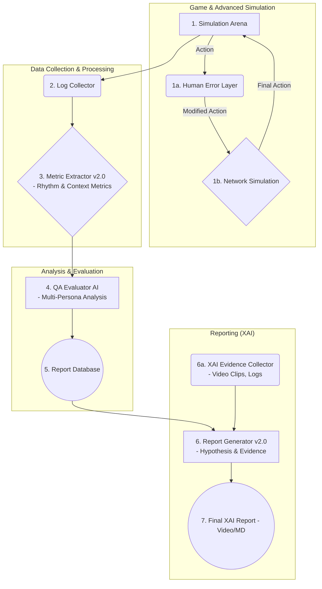

# Phase 7: 기술 명세서 (v2.0)

## 1. 시스템 아키텍처 (고도화)

본 시스템은 모듈식 파이프라인 아키텍처를 채택하여 각 컴포넌트의 독립적인 개발, 테스트, 확장을 용이하게 한다. **v2.0에서는 시뮬레이션 환경과 리포팅 단계가 대폭 강화되었다.**

### 1.1. 컴포넌트별 기술 명세 (v2.0)

- **1. Simulation Arena (고도화):**
  - **(추가) 1a. Human Error Layer:** AI 에이전트의 완벽한 액션(Action)을 입력받아, 설정된 확률에 따라 지연, 오입력, 누락 등의 '인간적 실수'를 주입하여 변조된 액션을 다음 단계로 전달한다. `Python`의 `random` 모듈을 사용하여 구현.
  - **(추가) 1b. Network Simulation:** '인간적 실수'가 반영된 액션에 가변적인 네트워크 지연(Latency) 및 패킷 손실(Packet Loss)을 시뮬레이션한다. `asyncio` 등을 활용하여 비동기적으로 지연을 주입하는 방식으로 구현.
  - **기술:** `WebRTC Data Channels (via PeerJS)`, `Python Subprocess`, `asyncio`.

- **2. Log Collector:**
  - **역할:** (변경 없음) Simulation Arena에서 발생하는 모든 이벤트를 수집하여 구조화된 로그 파일로 저장.
  - **기술:** `Python Logging`, `JSONL` 또는 `Parquet`.

- **3. Metric Extractor (v2.0):**
  - **(확장) 역할:** 원시 로그 데이터를 가공하여 4대 QA 계층에 해당하는 정량적 지표를 추출. **타격의 '순간' 지표뿐만 아니라, 액션과 액션 사이의 '리듬'과 '맥락'을 분석하는 지표(예: 콤보 연계성, 카운터플레이 시간차)를 추가로 추출한다.**
  - **기술:** `Python`, `Pandas`, `NumPy`, `Scikit-learn`.

- **4. QA Evaluator AI (v2.0):**
  - **(확장) 역할:** 추출된 메트릭을 종합적으로 평가. **단일 AI의 평가가 아닌, '초보자', '프로게이머' 등 여러 'AI 페르소나' 모델 그룹을 사용하여 각 페르소나 관점에서의 평가를 교차 검증한다.**
  - **기술:** `Python` 규칙 기반 로직, `TensorFlow/PyTorch` (다중 페르소나 모델 관리).

- **5. Report Database:**
  - **역할:** (변경 없음) 각 시뮬레이션 세션별 메트릭과 평가 결과를 저장.
  - **기술:** `SQLite`, `PostgreSQL` (선택 사항).

- **6. Report Generator (v2.0):**
  - **(확장) 역할:** 데이터베이스의 평가 결과를 바탕으로, **'정답'이 아닌 '가설' 형태의 텍스트와 명확한 근거 데이터를 포함하는 설명 가능한(XAI) 리포트를 생성한다.**
  - **(추가) 6a. XAI Evidence Collector:** 리포트의 핵심 가설(예: 'A스킬의 손맛 점수가 낮음')을 뒷받침하는 원본 로그 및 영상 클립을 자동으로 수집하고 리포트와 연결한다. `moviepy` 또는 `ffmpeg-python`을 사용하여 원본 리플레이 영상에서 특정 구간을 잘라내는 기능 구현.
  - **기술:** `Jinja2`, `gTTS`/`Coqui TTS`, `Blender (Python Scripting)`, `FFmpeg`, **(추가)** `moviepy`.

## 2. 개발 및 운영 환경

- **프로그래밍 언어:** `Python 3.10+`
- **가상 환경:** `venv` 또는 `Conda`
- **의존성 관리:** `pip`와 `requirements.txt`.
- **버전 관리:** `Git`, `GitHub`.
- **CI/CD (선택 사항):** `GitHub Actions`
- **운영체제:** `Linux (Ubuntu 22.04)`

## 3. 데이터 명세 (v2.0 초안)

- **(변경 없음) 게임 상태 (Observation):** `JSON` 형식.
- **(변경 없음) 행동 명령 (Action):** `JSON` 형식.
- **(확장) 이벤트 로그 (Event Log):** `JSONL` 형식. **'리듬' 측정, '인간적 실수' 주입, 'XAI 근거' 연동을 위한 신규 이벤트 타입 추가.** (예: `RHYTHM_METRIC_EVENT`, `HUMAN_ERROR_INJECTED_EVENT`, `XAI_EVIDENCE_LINK_EVENT`)
